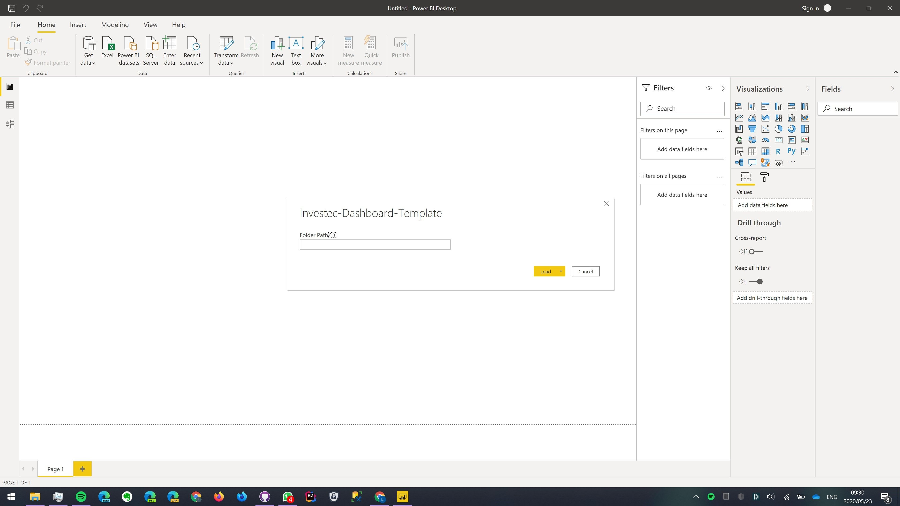
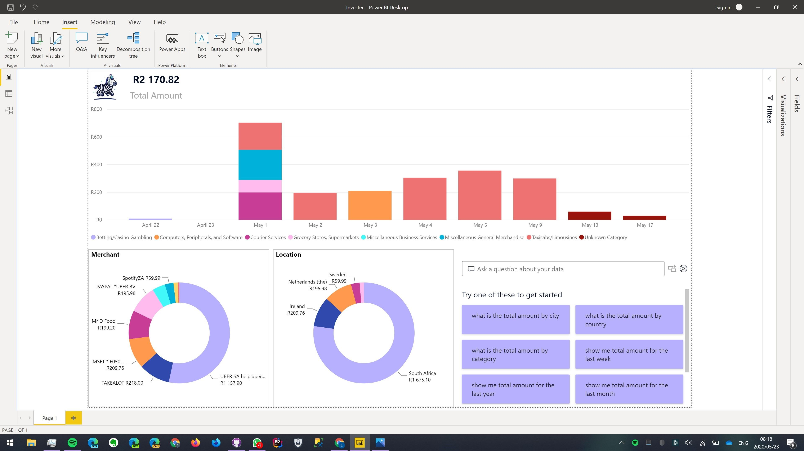

# Power BI Template for Investec's Programmable Banking transaction logs

## Prerequisites
* [Power BI Desktop](https://powerbi.microsoft.com/en-us/desktop/)

Open the template, `Investec-Dashboard-Template.pbit`

Then provide the path to where your transaction logs are stored or use the sample folder provided in this repo.

Click 'Load' then you should see the visualisations.

